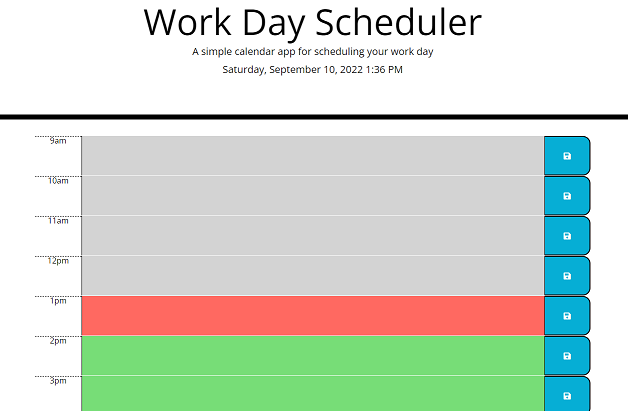
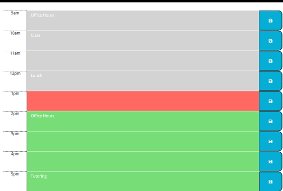
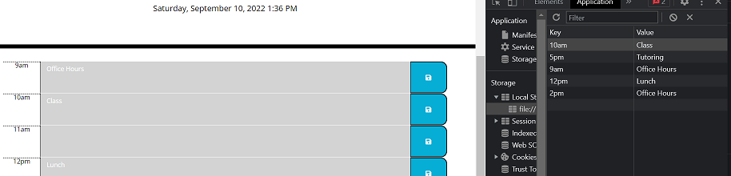

### Workday Scheduler

## Description
This is a scheduling application that runs in the web browser. It features time blocks colored gray for past hours, red for the current hour, and green for future hours. Events can be entered via text input and stored to show after the page refreshes. This application uses Bootstrap, Jquery, and Moment.js to create content.

## Link to Live Page
[Live Link](https://rosethorn10.github.io/workday-calendar/)

## Screenshots

